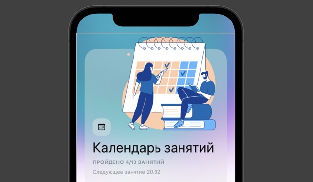

# Template for the SwiftUI Application

## Template for a small Swift application. Contains 4 key pages: 

* **HomepageView**: featured items, news and new application content 
* **CalendarView**: calendar of the upcoming events
* **QuizView**: interactive cards for words memorization
* **AccountView**: data about the user

## The demo of the application: 
Click on picture to see the demo

